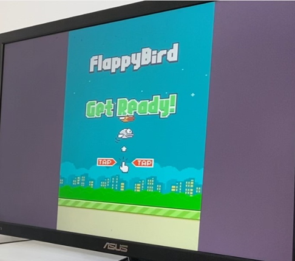
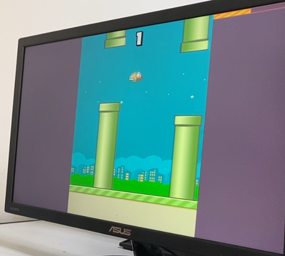
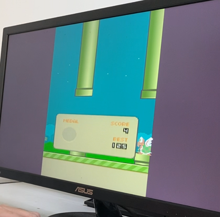
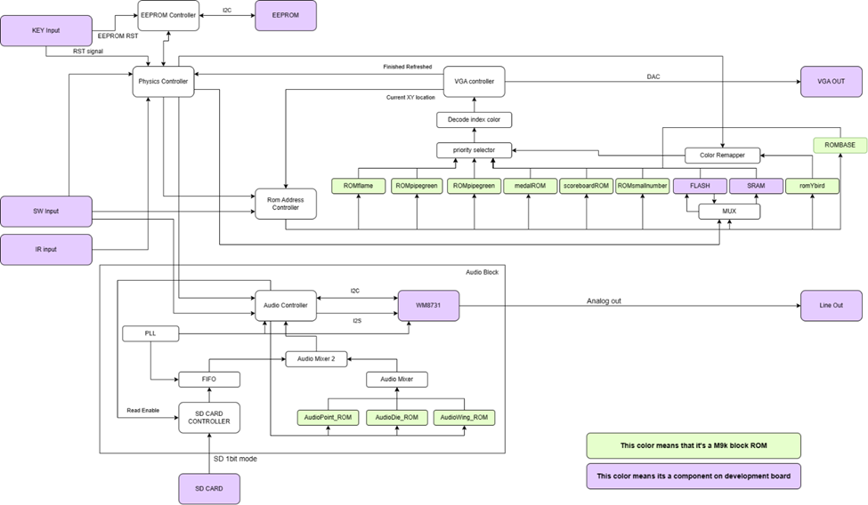

# FlappyBird-in-DE2-115-FPGA

### This is a Final Project for My FPGA Class. There are some stuff that are unfinished and will not be finished due to time constraint (mostly the sound part). Whole project is written in verilog. I do not have access to the board now so i will not be able to test the project. If you have any question feel free to contact me.
There is a small block diagram that shows how the project work, and some of the stuff is diliberately used to count as component used score (such as Flash and SRAM is used to store some image).

## How to run the project.
1. Download the project.
2. Open the project in Quartus. (I used Quartus 17.1) (You can also flash the .sof file directly to the FPGA if so skip to 5)
3. Compile the project.
4. Use DE2-115 control panel to program the Flash.(Program this "background-day_night_getready.bin" to the flash)
5. Program the FPGA (vga.sof).
6. Connect the VGA cable to the VGA port on the DE2-115 board.
7. You should see the game running on the screen.

## How to play the game.
Here is all the I/O for the game.
### Inputs
In all those states you can use onboard Switch to change background, bird color. 

•	SW[0] is used to change the background between day and night.

•	SW[1] is used to show collision box. (used for debugging).

•	SW[2] is used to disable collision (invisibility).

•	SW[4:3] is used to switch between the bird color 

	00 = yellow, 01 = red, 02 = blue, 03 = yellow.
•	SW[5] is used to enable / disable sound.

•	SW[15:6] is unused.

•	SW[16] is to enable enemy spawning.(collision unfinished)

•	SW[17] is to enable double density mode (From 1 pipe on screen to 2 pipes  on screen which is spaced evenly). This Feature can be switch on or off on the fly.

In all those states you can also use KEY.

•	KEY[0] is used to reset everything except EEPROM data(which where the high score is located).

•	KEY[1] is used to reset EEPROM data.

3 button is used on the IR remote.

•	IR2 is for jumping the bird.

•	IR3 is used to shoot flames when flame is ready.

•	Power button is used to change state between End game and idle state 

FLASH is used to store two backgrounds and get ready screen.
SRAM is used as a buffer for get ready screen picture, And the Data is stored inside the 8MB flash. At boot it will read data from flash to SRAM.

### Outputs
The Sound effect is output to line out jack (green color jack) on the FPGA development board. Connect to a speaker or earphone to output audio. Audio can be disabled using SW [5] set to high.
VGA is used as the primary display.
EEPROM on the board is used to store the best score as it was a non-volatile memory.
SD CARD is used to stream Background music.

## Issues and bugs

Background Audio is broken it will have crackling sound when low frequency sound is played. I still have no idea why this is happening.

Enemy collision is not implemented. I do not have enough time to implement this feature.

## How to change/set background music.
#### Do not do this on a SD card that you want to keep the data on. It will destory the file system on the SD card.
#### The Background music is broken please do not max out the volume on your speaker or earphone. It will damage your ear and speaker.
1. Use Audacity to convert the music to 16 bit 8000hz no header raw file.
2. Plug in the SD card to your computer.
3. Use HxD to open the SD card.
4. Copy the raw file to the SD card. (Remember the starting sector of the file and ending sector of the file)
5. Open the project in Quartus.
6. Go to the end of vga.v file, search for SDaudio2sectorstart and SDaudio2sectorend and change the value to the value you got from step 4.
7. Compile the project.
8. Program the FPGA.
9. Plug in the SD card to the FPGA.
10. You should hear the music playing after reset.

## State Machine
There are three main states in the game.
1.	Idle State
a.	In this state it will show the Get Ready Screen and moving base platform without any pipes.
2.	Playing State
a.	Pressing the Power Button in idle state will change into this state.
b.	In this state pipes will start spawning and the bird will start falling and responds with your input to jump.
3.	End game State
a.	After the bird collides with the pipes it will change to this state, until you press the Power button to change back to Idle state.
b.	This state is basically a kill screen it will show you your score, medal, and best score.

There are also a lot of small state machines inside the main states that manage loading/reading asset, setting/loading best scores, buffering asset.

## References
Here are some of the references (I copied :)) that i used to make this project. So without them is will be impossible for me to make this project.

[Game Asset by samuelcust](https://github.com/samuelcust/flappy-bird-assets)

[Audio Driver from AhmadGon WM8731-Audio-CODEC](https://github.com/AhmadGon/WM8731-Audio-CODEC)

[SD card module from WangXuan95](https://github.com/WangXuan95/FPGA-SDcard-Reader)

[Mixing Audio to prevent clipping](https://www.vttoth.com/CMS/technical-notes/?view=article&id=68)

